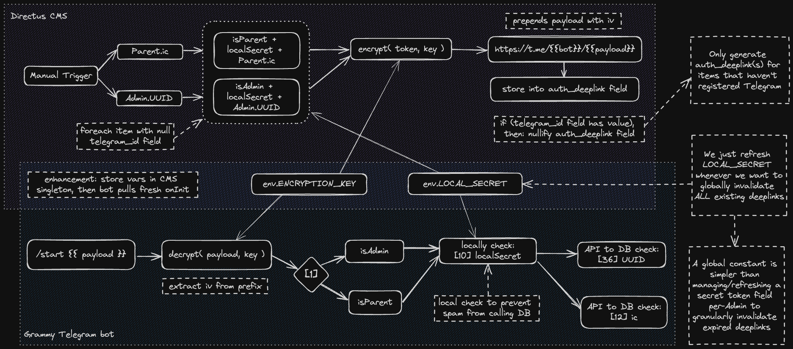
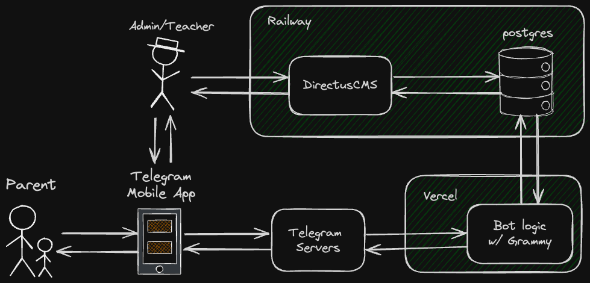

<h1 align="center">🤖 PowerKids Bot</h1>


> A Telegram bot for PowerKids Kindergarten.

## Goals

- **Admins/Teachers can send broadcast messages or weekly pictures** (from the convenience of their own mobile devices) and select relevant student names
- The bot will **match the each selected student to their parents**' Telegram account via the *school's internal database*
- **Parents will receive those pictures**, sent by the bot, instantly notified by Telegram's mobile push notifications
- **Users can effortlessly authenticate their unique identity & role with deeplinks**

### Benefits

1. No need for school staff to pass around a single company phone for communication
    - Parallel communication increases efficiency
    - School staff can handle their tasks according to their own schedule, not based on the common phone's availability
2. Database replaces the manual record of parents' contacts to students' names
    - Enforcing two-way anonymity and privacy because personal devices are obscured by the database layer,
    - Reduces chance for human error, sending message to the wrong parent
    - Ensures freshest data from database
3. Instant push notifications on parents' mobile phones
    - Quicker time-to-notification
4. Flexible target listing
    - Old system with WhatsApp was to either manually select contacts, or to send into a fixed group chat
    - Now, any custom combination of targets can be selected per-message

## Usage

1. Install Telegram on mobile or Web
2. Enter your unique (deeplink) URL in your web browser, as provided by your Administrator
3. As a parent, you will now automatically receive messages and pictures for your child(ren) by the school from the chatbot
4. As a school staff, you can now use `/sendmsg` to write out a message/attach a picture, select students, and the parents of those selected students will receive your message.

## Design

### Auth Deeplink



#### Pre-generating the deeplinks

- Administrators trigger manual [Flow](https://docs.directus.io/app/flows.html) in Directus
  - Uses a custom Operation extension
- Plaintext includes:
  - single-char prefix to identify between parent or admin auth
  - unique identifying field of the record
  - local secret (explained below)
- Plaintext is encrypted for the payload, to prevent malicious users from authenticating
  - initialization vector, if exists, may be prefixed before the ciphertext in the payload
- Stores deeplink into an `auth_deeplinks` field for each record
- Administrator can distribute the deeplinks according to a CMS view or export with the necessary fields

#### Using deeplinks

- Telegram has an inbuilt [deeplink](https://core.telegram.org/api/links) feature
- We don't want bad actors to spam the `/start` route with random payloads, causing excessive CMS API calls and DB access
  - We use a `LOCAL_SECRET`, shared between Directus CMS and the Bot
  - When generating the deeplinks, we include the `LOCAL_SECRET` in the plaintext
  - Later, when the bot receives a deeplink payload, it can locally decrypt and validate the `LOCAL_SECRET` segment before ever calling the CMS API
  - Basically ensures that the deeplink payload is genuinely created by us, even if the other segments of the plaintext are invalid
- Telegram's deeplinks only allow a `base64url`-charset & maximum 64-character payload
  - This severely limits the entropy of our payload, and thus limits the length of our plaintext
  - Have to be very economical to be able to derive a unique record and enforce tight security, while adhering to the 64-character payload limit
- Invalidating deeplinks are just a matter of regenerating the `LOCAL_SECRET` value
  - This invalidates all deeplinks, globally
  - Current implementation has not enough entropy to fit Telegram's payload limitations while having a unique Initialization Vector field for each user, in order to invalidate a specific user's link — this is currently outside MVP, may be enhanced later

> Note: This isn't the exact implementation, certain details are tweaked for obscurity purposely

### Send Message

#### Process

- Admin initiates the flow with `/sendmsg` command
  - Checks for admin status
- Admin attaches a message or picture with caption
- Admin selects a list of students
  - Bot communicates with the database to pull records of the parents' Telegram ID of the queried student
  - Bot gives error feedback if:
    - if query is not found in database
    - if student has no parents who have already registered
- Admin sends `/done` to finish the input
- The bot forwards the message to each target on the list
- The bot returns feedback on the operation

#### Considerations

- by simply forwarding the message, we don't need to store the message in memory
- each child may have multiple parents, and each parent may have multiple children
  - when selecting a child, it should send to both parents
  - when selecting siblings, it should deduplicate calls

## Developing

Follow these steps to set up and run your bot using this template:

1. **Clone New Repository**

2. **Environment Variables Setup**

    Create an environment variables file by copying the provided example file:

     ```bash
     cp .env.example .env
     ```

    Open the newly created `.env` file and set the `BOT_TOKEN` environment variable.

3. **Launching the Bot**

    You can run your bot in both development and production modes.

    **Development Mode:**

    Install the required dependencies:

    ```bash
    pnpm install
    ```

    Start the bot in watch mode (auto-reload when code changes):

    ```bash
    pnpm run dev
    ```

   **Production Mode:**

    Install only production dependencies (no development dependencies):

    ```bash
    pnpm install --only=prod
    ```

    Set the `NODE_ENV` environment variable to "production" in your `.env` file. Also, make sure to update `BOT_WEBHOOK` with the actual URL where your bot will receive updates.

    ```dotenv
    NODE_ENV=production
    BOT_WEBHOOK=<your_webhook_url>
    ```

    Start the bot in production mode:

    ```bash
    pnpm start
    # or
    pnpm run start:force # if you want to skip type checking
    ```

### List of Available Commands

- `pnpm run lint` — Lint source code.
- `pnpm run format` — Format source code.
- `pnpm run typecheck` — Run type checking.
- `pnpm run dev` — Start the bot in development mode.
- `pnpm run start` — Start the bot.
- `pnpm run start:force` — Starts the bot without type checking.

### Directory Structure

```filetree
project-root/
  ├── api
  │   └── server # Serverless entry point
  ├── locales # Localization files (currently unused)
  └── src
      ├── bot # Contains the code related to the bot
      │   ├── callback-data # Callback data builders
      │   ├── features      # Implementations of bot features
      │   │     └── (feature)
      │   │            ├── composer.ts # entry point for the directory
      │   │            └── conversation.ts # conversation handler
      │   ├── handlers      # Update handlers
      │   ├── helpers       # Utility functions
      │   ├── keyboards     # Keyboard builders (currently unused)
      │   ├── middlewares   # Middleware functions
      │   ├── i18n.ts       # Internationalization setup
      │   ├── context.ts    # Context object definition
      │   └── index.ts      # Bot entry point
      │
      ├── server # Contains the code related to the web server
      │   └── index.ts # Web server entry point
      ├── lib    # Utility modules
      │   ├── directus # Directus SDK abstractions
      │   └── *        # Whatever other utility modules
      ├── config.ts # Application config
      ├── logger.ts # Logging setup
      └── main.ts   # Application entry point (local)
```

## Tech Stack



- Frontend:
  - Mobile Client: [Telegram](https://telegram.org/)
- Backend (bot):
  - Template: [bot-base/telegram-bot-template](https://github.com/bot-base/telegram-bot-template)
    - Telegram Framework: [grammY](https://grammy.dev/)
    - Server Framework: [fastify](https://fastify.dev/)
    - Logger: [pino](https://github.com/pinojs/pino)
  - Infrastructure: [Vercel](https://vercel.com/)
- Backend (db):
  - CMS: [Directus](https://directus.io/)
  - Database: [postgres](https://www.postgresql.org/)
  - Container: [Docker](https://www.docker.com/)
  - Infrastructure: [Railway](https://railway.app/)
  - Domain: [Exabytes](https://www.exabytes.com/) *(.edu.my)*

## Environment Variables

<table>
<thead>
  <tr>
    <th>Variable</th>
    <th>Type</th>
    <th>Description</th>
  </tr>
</thead>
<tbody>
  <tr>
    <td>NODE_ENV</td>
    <td>String</td>
    <td>Specifies the application environment. (<code>development</code> or <code>production</code>)</td>
  </tr>
  <tr>
    <td>BOT_TOKEN</td>
    <td>
        String
    </td>
    <td>
        Telegram Bot API token obtained from <a href="https://t.me/BotFather">@BotFather</a>.
    </td>
  </tr>
    <tr>
    <td>LOG_LEVEL</td>
    <td>
        String
    </td>
    <td>
        <i>Optional.</i>
        Specifies the application log level. <br/>
        For example, use <code>info</code> for general logging. View the <a href="https://github.com/pinojs/pino/blob/master/docs/api.md#level-string">Pino documentation</a> for more log level options. <br/>
        Defaults to <code>info</code>.
    </td>
  </tr>
  <tr>
    <td>BOT_MODE</td>
    <td>
        String
    </td>
    <td>
        <i>Optional.</i>
        Specifies method to receive incoming updates. (<code>polling</code> or <code>webhook</code>)
        Defaults to <code>polling</code>. (You should use webhook in <b>production</b> environment)
    </td>
  </tr>
  <tr>
    <td>BOT_WEBHOOK</td>
    <td>
        String
    </td>
    <td>
        <i>Optional in <code>polling</code> mode.</i>
        Webhook endpoint URL, used to configure webhook in <b>production</b> environment.
    </td>
  </tr>
  <tr>
    <td>BOT_SERVER_HOST</td>
    <td>
        String
    </td>
    <td>
        <i>Optional.</i> Specifies the server hostname. <br/>
        Defaults to <code>0.0.0.0</code>.
    </td>
  </tr>
  <tr>
    <td>BOT_SERVER_PORT</td>
    <td>
        Number
    </td>
    <td>
        <i>Optional.</i> Specifies the server port. <br/>
        Defaults to <code>80</code>.
    </td>
  </tr>
  <tr>
    <td>BOT_ALLOWED_UPDATES</td>
    <td>
        Array of String
    </td>
    <td>
        <i>Optional.</i> A JSON-serialized list of the update types you want your bot to receive. See <a href="https://core.telegram.org/bots/api#update">Update</a> for a complete list of available update types. <br/>
        Defaults to an empty array (all update types except <code>chat_member</code>).
    </td>
  </tr>
  <tr>
  <td></td>
  <td></td>
  <td></td>
  </tr>
  <tr>
    <td>DIRECTUS_STATIC_TOKEN</td>
    <td>
        String
    </td>
    <td>
      Static token from the Telegram dummy user in Directus, configured with appropriate limited permissions
    </td>
  </tr>
  <tr>
    <td>DIRECTUS_URL</td>
    <td>
        String
    </td>
    <td>
      Public base URL to access the Directus API
    </td>
  </tr>
  <tr>
  <td></td>
  <td></td>
  <td></td>
  </tr>
  <tr>
    <td>ENCRYPTION_METHOD</td>
    <td>
        String
    </td>
    <td>
      An algorithm from
      <a href="https://developer.mozilla.org/en-US/docs/Web/API/SubtleCrypto/encrypt#supported_algorithms">Web Cryptography API: SubtleCrypt supported algorithms</a>
    </td>
  </tr>
  <tr>
    <td>ENCRYPTION_KEY</td>
    <td>
        String
    </td>
    <td>
      Shared decryption key between bot and CMS to decode deeplink payloads
    </td>
  </tr>
  <tr>
    <td>LOCAL_SECRET</td>
    <td>
        String
    </td>
    <td>
      Shared secret between bot and CMS to validate deeplink payloads (locally)
    </td>
  </tr>
</tbody>
</table>

## Future Work

1. Select a group of students with a filter defined in Directus Presets
2. Screening system for principals to vet quality of messages before they go out
3. Send more than one message, a series of messages
4. Accountability logs in CMS
    - messages sent out
    - error logs
